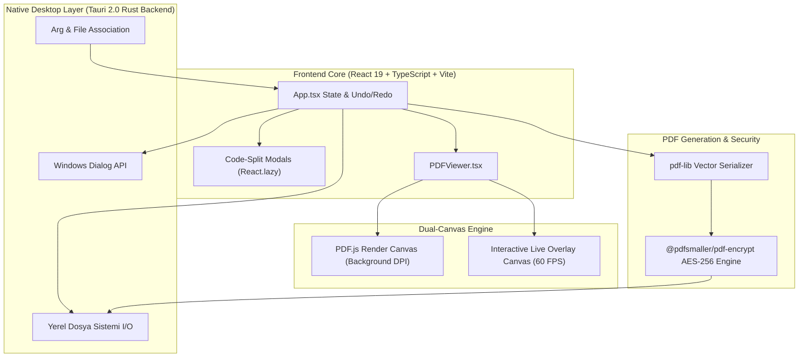

<div align="center">

# 🚀 PDF Studio Pro

<p align="center">
  <strong>Ultra Hızlı, Modern, Askeri Düzeyde Güvenli ve %100 Çevrimdışı Masaüstü PDF Düzenleme & Üretkenlik Paketi</strong>
</p>

[](https://github.com/eekilinc/pdfstudio/releases/latest)
[](https://github.com/eekilinc/pdfstudio/actions)
[](https://github.com/eekilinc/pdfstudio)
[](https://tauri.app/)
[](https://react.dev/)
[](https://mozilla.github.io/pdf.js/)
[](https://github.com/eekilinc/pdfstudio)
[](LICENSE)

<br/>

> **PDF Studio Pro**, tarayıcı sınırlarını aşan yerel masaüstü performansı, gelişmiş çift katmanlı tuval mimarisi (Dual-Canvas), optik karakter tanıma (OCR), doğrudan PDF metin değiştirme ve gerçek **AES-256** şifreleme desteği sunan yeni nesil bir PDF düzenleyicisidir. Hiçbir veriniz internete gönderilmez; her işlem tamamen bilgisayarınızda gerçekleşir.

<br/>

[⬇️ **En Son Windows Sürümünü İndir (.exe)**](https://github.com/eekilinc/pdfstudio/releases/latest) • [✨ Özellikler](#-öne-çıkan-başlıca-özellikler) • [⌨️ Kısayollar](#️-klavye-kısayolları)

</div>

---

## 📑 İçindekiler

- [✨ Öne Çıkan Başlıca Özellikler](#-öne-çıkan-başlıca-özellikler)
  - [1. Doğrudan PDF Metin Düzenleme & Akıllı OCR](#1-doğrudan-pdf-metin-düzenleme--akıllı-ocr)
  - [2. Askeri Düzeyde AES-256 Şifreleme & İzin Yönetimi](#2-askeri-düzeyde-aes-256-şifreleme--izin-yönetimi)
  - [3. Çizim, Vurgulama, Dijital İmza, Damga & Cetvel](#3-çizim-vurgulama-dijital-imza-damga--cetvel)
  - [4. Gelişmiş Belge & Sayfa Yönetimi (Split & Merge)](#4-gelişmiş-belge--sayfa-yönetimi-split--merge)
  - [5. Çok Formatlı Ofis Dışa Aktarım Merkezi](#5-çok-formatlı-ofis-dışa-aktarım-merkezi)
  - [6. Çift PDF Yan Yana Karşılaştırma (Side-by-Side Diff)](#6-çift-pdf-yan-yana-karşılaştırma-side-by-side-diff)
  - [7. Boyut Küçültme (Compress) & Hassas Veri Karartma (Redact)](#7-boyut-küçültme-compress--hassas-veri-karartma-redact)
  - [8. Komut Paleti, Belge Özellikleri, Durum Çubuğu & Sunum Modu](#8-komut-paleti-belge-özellikleri-durum-çubuğu--sunum-modu)
- [🏗️ Sistem Mimarisi & Veri Akışı](#️-sistem-mimarisi--veri-akışı)
- [⚡ Performans & Kod Bölümleme (Code Splitting)](#-performans--kod-bölümleme-code-splitting)
- [⌨️ Klavye Kısayolları](#️-klavye-kısayolları)
- [🛠️ Teknolojik Altyapı](#️-teknolojik-altyapı)
- [🚀 Geliştirme & Kurulum Rehberi](#-geliştirme--kurulum-rehberi)
- [🔒 Gizlilik ve Güvenlik Beyannamesi](#-gizlilik-ve-güvenlik-beyannamesi)
- [📄 Lisans](#-lisans)

---

## ✨ Öne Çıkan Başlıca Özellikler

### 1. Doğrudan PDF Metin Düzenleme & Akıllı OCR
- **Doğrudan Metin Değiştirme (`E` - Edit Text):** PDF üzerindeki mevcut metin bloklarına tıklayın; font ailesi, ağırlığı ve arka plan piksel rengi canlı olarak tespit edilir, metin anında düzenlenebilir hale gelir.
- **Tesseract.js OCR:** Taranmış evrak, kitap ve sözleşmeleri Türkçe ve İngilizce dil modelleriyle tarayarak saniyeler içinde düzenlenebilir ve aranabilir metne dönüştürün.
- **Metin Seçimi, Kopyalama & Anında Çeviri:** Belgedeki metin katmanından seçim yapıp tek tıkla panoya kopyalayın veya Türkçe'ye çevirin.

### 2. Askeri Düzeyde AES-256 Şifreleme & İzin Yönetimi
- **Web Crypto AES-256:** PDF belgelerinizi endüstri standardı **256-bit AES** şifreleme ile koruma altına alın.
- **Granüler Yetkilendirme:** 
  - Belge açılış parolası (User Password) belirleme.
  - İsteğe bağlı yönetici parolası (Owner/Master Password) tanımlama.
  - Yazdırma (Print), metin/resim kopyalama (Copy) ve düzenleme (Modify) haklarını ayrı ayrı kısıtlama.
- **Geriye Dönük Uyumluluk:** Eski PDF okuyucular için RC4 128-bit şifreleme profili seçeneği.

### 3. Çizim, Vurgulama, Dijital İmza, Damga & Cetvel
- **60 FPS Canlı Vektörel Çizim:** Akıcı serbest çizim kalemi (`P`) ve yarı saydam fosforlu kalem.
- **Dinamik Şeffaflık & Renk Paleti:** Çizim, şekil ve metinlerin opaklığını %10 ile %100 arasında anlık ayarlayın.
- **Resmi Kaşe & Damgalar:** `ONAYLANDI`, `GİZLİ`, `TASLAK`, `REDDEDİLDİ`, `TAMAMLANDI` gibi hazır veya tarihli özel damgalar basın.
- **Çizerek veya Resimden İmza:** Farenizle imzanızı çizin veya şeffaf PNG kaşe yükleyip boyutlandırın.
- **Teknik Ölçüm Cetveli (Ruler):** Plan ve mimari paftalar üzerinde iki nokta arasındaki net mesafeyi (`cm`, `mm`, `inç`) hassas hesaplayın.
- **Tıklanabilir Onay Kutusu (Checkbox):** Etkileşimli `☑` / `☐` kontrol kutuları yerleştirin.

### 4. Gelişmiş Belge & Sayfa Yönetimi (Split & Merge)
- **PDF Bölme (Split):**
  - Sayfa aralığı çıkarma (`1-3, 5, 8-12`).
  - Her sayfayı ayrı birer PDF yapma.
  - Tek ve çift sayfaları iki ayrı dosyaya ayırma.
  - Sayfa bloklarına (örn. 2'şer sayfa) göre otomatik bölme.
- **PDF Birleştirme (Merge):** Sürükle-bırak ile birden fazla PDF'i dilediğiniz sırada tek belgede toplayın.
- **Görsel Sayfa Sıralama (Thumbnail Sidebar):** Sayfaları sürükleyip bırakarak taşıyın, 90° döndürün, çoğaltın veya silin.
- **Sayfa Numaralandırma & Filigran:** Tek tıkla altbilgi/üstbilgi formatlarında sayfa numarası ve yarı saydam filigran ekleyin.

### 5. Çok Formatlı Ofis Dışa Aktarım Merkezi
| Format | Uzantı | Açıklama |
|---|---|---|
| **Microsoft Word** | `.docx / .doc` | Paragraf, başlık ve hizalamaları koruyarak Word belgesine dönüştürür. |
| **Microsoft Excel** | `.xlsx / .csv` | Tablo ve listeleri satır/sütun tablosu halinde UTF-8 BOM destekli Excel dosyası yapar. |
| **PowerPoint** | `.pptx / HTML` | Her PDF sayfasını bağımsız bir sunum slaytına dönüştürür. |
| **Markdown** | `.md` | Dokümantasyon için başlık ve listeleri temiz Markdown formatında dışa aktarır. |
| **Düz Metin** | `.txt` | Tüm formatlardan arındırılmış temiz UTF-8 saf metin çıktısı verir. |
| **Web Sayfası** | `.html` | Modern ve bağımsız web sayfası olarak kaydeder. |
| **Görsel Paketi** | `.png / .jpg` | Sayfaları yüksek çözünürlüklü raster görsel formatında dışa aktarır. |

### 6. Çift PDF Yan Yana Karşılaştırma (Side-by-Side Diff)
- İki farklı revizyonu veya sözleşmeyi yan yana açarak **eşzamanlı kaydırma (synchronized scroll)** ile sayfa sayfa karşılaştırın.

### 7. Boyut Küçültme (Compress) & Hassas Veri Karartma (Redact)
- **PDF Sıkıştırma:** Düşük, Orta ve Yüksek sıkıştırma profilleriyle dosya boyutunu %80'e varan oranlarda küçültün.
- **Kalıcı Karartma (Redaction):** TC Kimlik, IBAN, telefon gibi hassas kişisel verileri kalıcı siyah/beyaz bloklarla maskeleyip dışa aktarın.

### 8. Komut Paleti, Belge Özellikleri, Durum Çubuğu & Sunum Modu
- **Raycast / Spotlight Hızlı Komut Paleti (`Ctrl+K`):** Menüler arasında kaybolmadan klavyeden arama yapın; tüm araçlar, dışa aktarım seçenekleri ve görünüm filtrelerine anında erişin.
- **Belge Özellikleri & Metaveri Düzenleyici (`Ctrl+D`):** PDF versiyonu, kağıt ebatları, üretici motor gibi teknik detayları inceleyin; Başlık, Yazar, Konu ve Anahtar Kelimeler gibi PDF metaverilerini doğrudan düzenleyip kaydedin.
- **Modern Alt Durum Çubuğu (Status Bar):** Aktif araç rozeti, sayfa numarası, milimetrik kağıt formatı (`A4 210 × 297 mm`), kayıt durumu (`Kaydedilmemiş` / `Kaydedildi`) ve hızlı yakınlaştırma ön ayarlarını alt bantta şık bir şekilde sunar.
- **Dikkat Dağıtmayan Tam Ekran Sunum Modu (`F11`):** Başlık çubuğu ve menüleri gizleyerek belgeyi odak noktası haline getirir; yüzen minimal gezinme kapsülü ile slayt gibi sunum yapmanızı sağlar.
- **Glassmorphic Bildirim Sistemi (Toast):** Klasik tarayıcı uyarı pencereleri yerine modern, animasyonlu ve bilgilendirici durum bildirimleri.

---

## 🏗️ Sistem Mimarisi & Veri Akışı

PDF Studio Pro, yüksek performans ve güvenlik için ayrık sorumluluk ilkesine (SoC) dayalı modüler bir mimari kullanır:



---

## ⚡ Performans & Kod Bölümleme (Code Splitting)

Vite 8 ve React 19 mimarisi ile ağır modüller başlangıç paketinden ayrılmıştır (Code Splitting):

- **Ana Yükleme Paketi:** ~105 kB (Gzip: ~27 kB) — Anında açılış.
- **İhtiyaç Anında Yüklenen Parçalar (On-Demand Lazy Chunks):**
  - `OcrModal` & `Tesseract`: Yalnızca OCR aracı açıldığında yüklenir.
  - `ExportOfficeModal`: Yalnızca ofis dışa aktarım penceresi istendiğinde yüklenir.
  - `SecurityModal` & `AES-256 Engine`: Yalnızca şifreleme istendiğinde yüklenir.
  - `ComparePdfModal`: Yalnızca karşılaştırma modu açıldığında yüklenir.

---

## ⌨️ Klavye Kısayolları

| Kısayol | İşlev |
|---|---|
| <kbd>Ctrl</kbd> + <kbd>S</kbd> | **Doğrudan Kaydet** (Açılan dosyanın orijinal konumuna anında üzerine yazar) |
| <kbd>Ctrl</kbd> + <kbd>Shift</kbd> + <kbd>S</kbd> | **Farklı Kaydet...** (Yerel Windows dosya seçici ile konum ve ad seç) |
| <kbd>Ctrl</kbd> + <kbd>O</kbd> | **PDF Aç** (Yerel dosya penceresi) |
| <kbd>Ctrl</kbd> + <kbd>Mouse Tekerleği</kbd> | **Akıllı Odaklı Yakınlaştırma / Uzaklaştırma** (%25 - %400) |
| <kbd>Ctrl</kbd> + <kbd>Z</kbd> | **Geri Al** (Undo) |
| <kbd>Ctrl</kbd> + <kbd>Y</kbd> / <kbd>Ctrl</kbd> + <kbd>Shift</kbd> + <kbd>Z</kbd> | **Yinele** (Redo) |
| <kbd>Ctrl</kbd> + <kbd>F</kbd> | **Belge İçi Hızlı Arama & Vurgulama** |
| <kbd>Ctrl</kbd> + <kbd>P</kbd> | **Yazdır** (Native Print) |
| <kbd>V</kbd> | **Seç & Taşı & Kopyala** Aracı |
| <kbd>H</kbd> | **Sayfayı Kaydır / Gezin (Pan)** Aracı |
| <kbd>E</kbd> | **Doğrudan PDF Metin Düzenleme** Aracı |
| <kbd>P</kbd> | **Serbest Çizim Kalemi** |
| <kbd>T</kbd> | **Yeni Metin Kutusu Ekle** |
| <kbd>Ctrl</kbd> + <kbd>K</kbd> | **Hızlı Komut Paleti (Spotlight Search)** |
| <kbd>Ctrl</kbd> + <kbd>D</kbd> | **Belge Özellikleri & Metaveri Bilgisi / Düzenleyici** |
| <kbd>F11</kbd> | **Tam Ekran Sunum Modu** (Presentation Mode) |
| <kbd>Ctrl</kbd> + <kbd>0</kbd> | **Sayfayı Ekrana Sığdır** (Fit to Page) |
| <kbd>Ctrl</kbd> + <kbd>1</kbd> | **%100 Orijinal Boyut** (Actual Size) |
| <kbd>Esc</kbd> | **Tam Ekrandan Çık / Açık Pencereleri Kapat** |
| <kbd>Delete</kbd> / <kbd>Backspace</kbd> | **Seçili Çizim / Şekil / Damgayı Sil** |

---

## 🛠️ Teknolojik Altyapı

- **Masaüstü Motoru:** [Tauri 2.0](https://tauri.app/) (Rust 1.77+, ultra hafif bellek ayak izi)
- **Kullanıcı Arayüzü:** React 19, TypeScript, Vite 8
- **PDF Render & Metin:** PDF.js (`pdfjs-dist 6.2` Web Worker)
- **PDF Oluşturma & Dönüşüm:** `pdf-lib 1.17`
- **Şifreleme Motoru:** `@pdfsmaller/pdf-encrypt` (Web Crypto AES-256 & RC4)
- **OCR Motoru:** `tesseract.js 7.0` (Türkçe + İngilizce modelleri)
- **İkon Seti & Tasarım:** Lucide React, Glassmorphism, Saf CSS Değişkenleri
- **Statik Kod Analizi:** Oxlint (Sıfır hata, sıfır uyarı)

---

## 🚀 Geliştirme & Kurulum Rehberi

### Gereksinimler
- [Node.js](https://nodejs.org/) (v18 veya üzeri)
- [Rust & Cargo](https://www.rust-lang.org/) (Tauri derlemesi için)

### Kurulum

```bash
# Depoyu klonlayın
git clone https://github.com/eekilinc/pdfstudio.git

# Proje dizinine gidin
cd pdfstudio

# Bağımlılıkları yükleyin
npm install
```

### Geliştirme Modunu Başlatma

```bash
# Ön yüzü ve Tauri masaüstü penceresini hot-reload ile çalıştırın
npm run tauri dev
```

### Statik Kod Analizi & Derleme Testi

```bash
# Oxlint ile linter kontrolü
npm run lint

# TypeScript tipi ve Vite bundle derlemesi
npm run build
```

### Tek Komutla Otomatik Sürüm Eşitleme (Version Bump)

Tüm proje dosyalarındaki (`package.json`, `tauri.conf.json`, `Cargo.toml`, `version.ts`) sürüm numarasını tek komutla günceller:

```bash
npm run bump:patch   # 0.1.0 -> 0.1.1
npm run bump:minor   # 0.1.0 -> 0.2.0
npm run bump:major   # 0.1.0 -> 1.0.0
```

### Üretim Dağıtımı (Windows x64 NSIS Installer)

```bash
# Kurulum paketi (.exe) ve taşınabilir binary oluşturun
npm run tauri build
```

Derlenen dosyalar:
- **NSIS Kurulum Dosyası:** `src-tauri/target/release/bundle/nsis/PDFStudio_*.exe`
- **Taşınabilir (Portable) EXE:** `src-tauri/target/release/app.exe`

---

## 🔒 Gizlilik ve Güvenlik Beyannamesi

PDF Studio Pro, **%100 Yerel (Local-Only) ve Çevrimdışı** çalışacak şekilde tasarlanmıştır.

1. **Sıfır Telemetri:** Hiçbir kullanıcı aktivitesi, analiz verisi veya kayıt tutulmaz.
2. **Sıfır Bulut Bağımlılığı:** Açtığınız veya şifrelediğiniz hiçbir doküman harici bir sunucuya aktarılmaz.
3. **Gerçek AES-256 Şifreleme:** Parolalar istemcide Web Crypto API ile işlenir ve diske doğrudan şifreli kaydedilir.

---

## 📄 Lisans

Bu proje [MIT Lisansı](LICENSE) altında özgürce geliştirilmekte ve dağıtılmaktadır.
